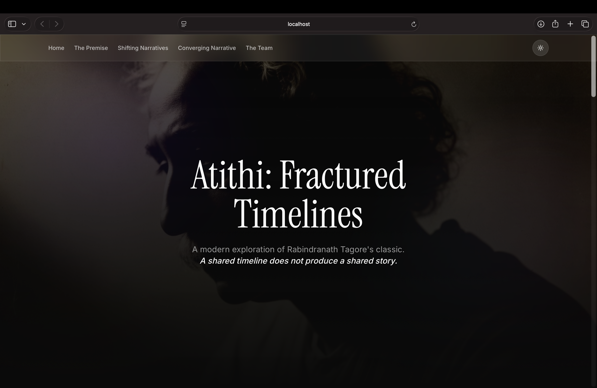
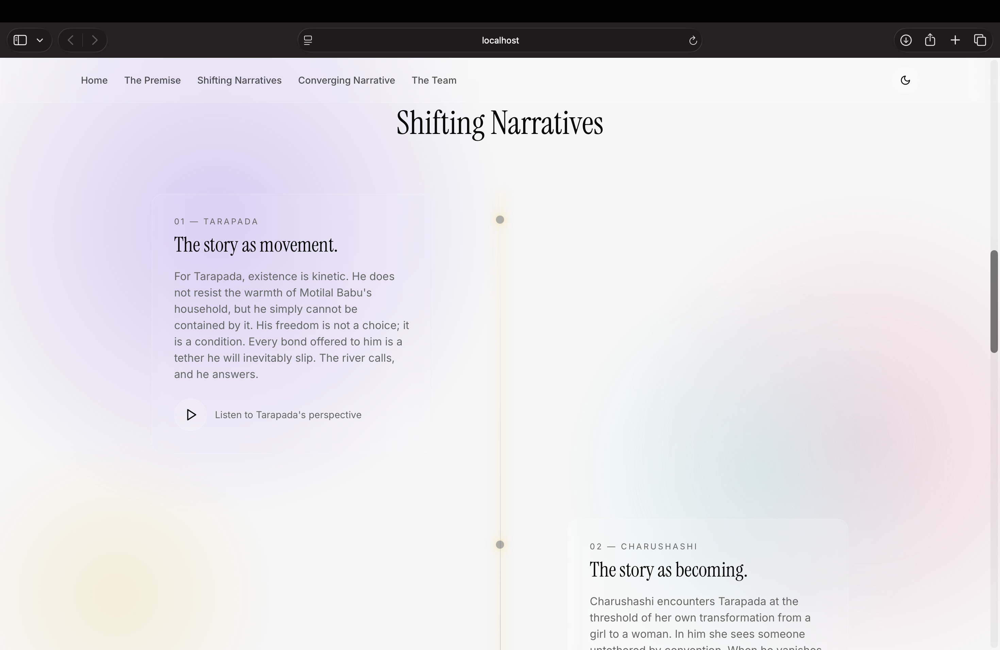
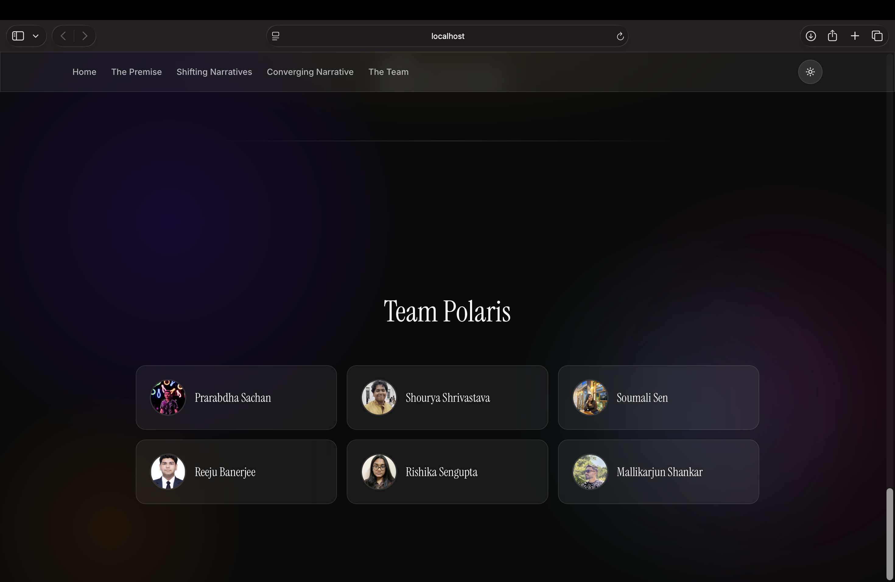

#  Atithi: Fractured Timelines

> **"A shared timeline does not produce a shared story."**

**Atithi: Fractured Timelines** is an interactive, hyper-premium web experience analyzing Rabindranath Tagore's classic short story, *The Guest* (*Atithi*). Built as a cinematic, single-page scrolling journey, this project explores how identical events fracture across different psychological perspectives. 

What appears stable from the outside can feel entirely different from within. The same moment holds different meanings depending on who is living through it.

### [**Experience the Live Project Here**](https://prarabdha7.github.io/English-Project/) 

---

##  Interface Gallery

*Click the links below to jump directly to the UI previews:*
* [1. The Hero](#1-the-hero)
* [2. The Shifting Narratives (Timeline)](#2-the-shifting-narratives)
* [3. The Team Architecture](#3-the-team-bento-grid)

### 1. The Hero 
*The entry point. Deep contrast, ambient gradients, and glassmorphic audio controls introducing the core thesis.*

 

### 2. The Shifting Narratives
*A dynamic, scroll-triggered vertical timeline where each character's psychological reality is mapped to a spatial node.*

### 3. The Team (Bento Grid)
*The project architects, presented in a high-end, interactive Bento layout with fluid tilt mechanics.*

---

##  The Narrative Architecture

This project discards traditional multi-page navigation in favor of a continuous, psychology-driven scroll.

* **The Premise:** Sets the academic foundation, establishing that plot and experience are not the same. *(Audio narration by Prarabdha)*
* **The Shifting Timeline:** A vertical, alternating matrix exploring four distinct realities:
  * **Tarapada:** *The story as movement.* He cannot be contained by the household; his freedom is a condition, not a choice. *(Voice: Shourya)*
  * **Charushashi:** *The story as becoming.* She sees a possibility untethered by convention, experiencing emotional change without direct expression. *(Voice: Soumali)*
  * **Motilal Babu:** *The story as order.* The architect of belonging, building a future that ultimately fails to hold. *(Voice: Reeju)*
  * **Sonamoni:** *The story as observation.* The youngest witness, noticing presence and absence without a personal agenda. *(Voice: Rishika)*
* **The Convergence:** The concluding narrative tying the fractured perspectives together, proving no single viewpoint completes the story. *(Audio narration by Mallikarjun)*

---

## The Architects

This project was conceptualized, designed, and narrated by:

* **Prarabdha** — *Introduction & The Premise*
* **Shourya** — *Tarapada's Perspective*
* **Soumali** — *Charushashi's Perspective*
* **Reeju** — *Motilal Babu's Perspective*
* **Rishika** — *Sonamoni's Perspective*
* **Mallikarjun** — *The Conclusion*

---
*Developed for Communicative English | 2026*